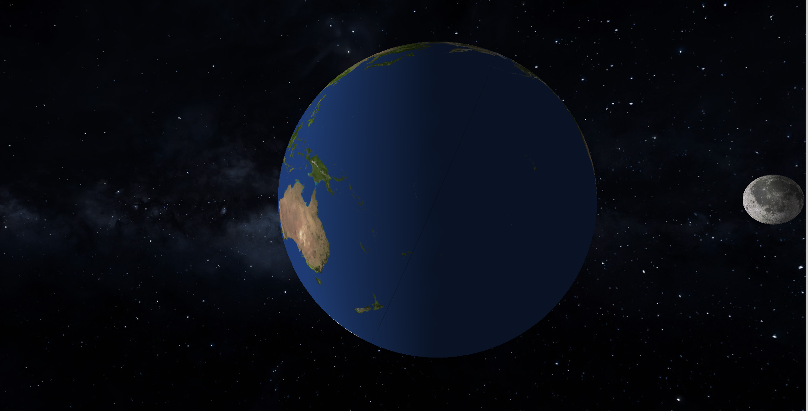
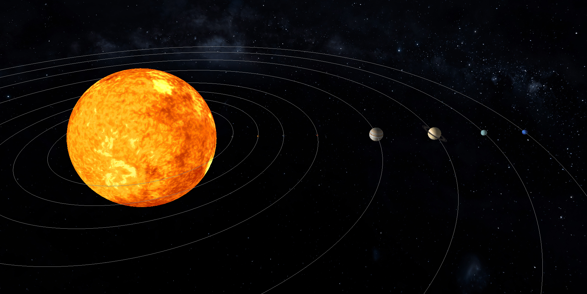

# Sistema Solar (OpenGL/GLUT)
## Oque o programa faz:  

Pequena simulação do sistema solar para estudos de computação gráfica.  

## Comando para compilar:
#1 sudo apt-get install freeglut3-dev para instalar o GLUT  

#2 sudo apt-get install libsoil-dev  

#3 g++ src/main.cpp  src/astro.cpp src/camera.cpp src/textura.cpp -o sis -lGL -lGLU -lSOIL -lglut -lm  && ./sis

## Texturas
Site com as texturas: https://www.solarsystemscope.com/textures/

## Imagens do projeto

 

 

## Principais problemas encontrados:

Alterar as propriedades do material(Sol) para que deixe ele emitindo luz,problemas para achar os melhores valores para as rotações e translações dos planetas.

## O que pode ser melhorado:  

Melhorar as texturas, colocar o sinturão de cometas e fazer o anel de saturno melhorado.

## O que cada integrante fez:

No geral fizemos juntos em call, porém Rodrigo e João Marcelo focando em iluminação,textura,camera,teclas de movimento e Anderson no posicionamento dos planetas
e movimento deles(rotação e translação).

